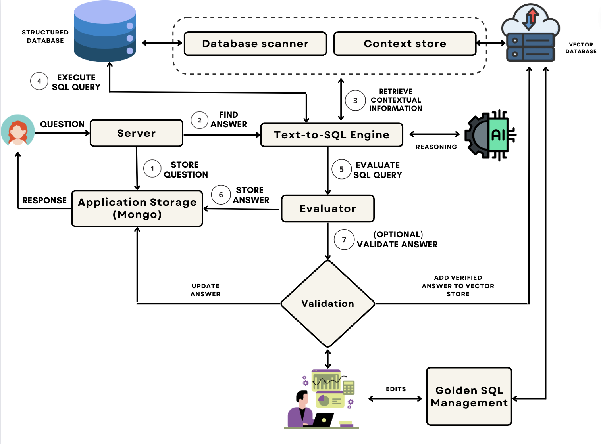

.. _dataherald-modules:

Dataherald: Modules
====================================================

Welcome to the documentation for Dataherald, your gateway to a seamless interaction between natural language and databases. This comprehensive guide provides insights into the architecture and functionality of the system's key modules.

.. toctree::
   :maxdepth: 2

   context_store
   text_to_sql_engine
   api_server
   evaluator
   vector_store
   db

Introduction
------------

Dataherald is a cutting-edge solution that empowers users to effortlessly interact with databases using natural language queries. The system comprises several interlinked modules that collectively enable a smooth user experience.

System Modules
--------------

Explore the following modules to gain a deeper understanding of how Dataherald works:

- :doc:`Context Store <context_store>`: Learn about the intelligent context management that enhances query understanding and accuracy.

- :doc:`Text-to-SQL Engine <text_to_sql_engine>`: Discover how natural language queries are intelligently transformed into SQL queries.

- :doc:`API Server <api_server>`: Dive into the core of Dataherald's communication interface, enabling seamless interaction between different parts of our system.

- :doc:`Evaluator <evaluator>`: Understand the process we have for providing a confidence score for generated queries.

- :doc:`Vector Store <vector_store>`: Explore the storage mechanism for efficiently storing the verfied Question/SQL pairs.

- :doc:`Database Integration <db>`: Learn about the supported databases and how you can connect you database with our system.

System architecture
--------------------

The following figure shows the general architecture of our system.

Getting Started
---------------

If you're new to Dataherald, we recommend starting with the :doc:`Getting started <getting_started>` for an overview of the system's capabilities. From there, proceed to the individual module documentation to get a comprehensive grasp of each module's role within the system.

Get Involved
------------

We encourage you to actively engage with the Dataherald community. If you have questions, feedback, or contributions, please visit our GitHub repository at [DataHerald GitHub](https://github.com/Dataherald). Your input drives our ongoing development and improvement.

Let's embark on an exploration of the Dataherald architecture and modules. The future of intuitive database interaction starts here!

:ref:`Back to Top <dataherald-modules>`
